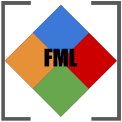

# fml

* **Version:** 0.3-0
* **Status:** [](https://travis-ci.org/fml-fam/fml)
* **License:** [BSL-1.0](http://opensource.org/licenses/BSL-1.0)
* **Project home**: https://github.com/fml-fam/fml
* **Bug reports**: https://github.com/fml-fam/fml/issues
* **Documentation**: https://fml-fam.github.io/fml




fml is the Fused Matrix Library, a multi-source, header-only C++ library for dense matrix computing. The emphasis is on real-valued matrix types (`float`, `double`, and `__half`) for numerical operations useful for data analysis.

The goal of fml is to be "medium-level". That is, high-level compared to working directly with e.g. the BLAS or CUDA™, but low(er)-level compared to other C++ matrix frameworks. Some knowledge of the use of LAPACK will make many choices in fml make more sense.

The library provides 4 main classes: `cpumat`, `gpumat`, `parmat`, and `mpimat`. These are mostly what they sound like, but the particular details are:

* <font color="blue">CPU</font>: Single node cpu computing (multi-threaded if using multi-threaded BLAS and linking with OpenMP).
* <font color="green">GPU</font>: Single gpu computing.
* <font color="red">MPI</font>: Multi-node computing via ScaLAPACK (+gpus if using [SLATE](http://icl.utk.edu/slate/)).
* <font color="orange">PAR</font>: Multi-node and/or multi-gpu computing.

There are some differences in how objects of any particular type are constructed. But the high level APIs are largely the same between the objects. The goal is to be able to quickly create laptop-scale prototypes that are then easily converted into large scale gpu/multi-node/multi-gpu/multi-node+multi-gpu codes.


## Installation

The library is header-only so no installation is strictly necessary. You can just include a copy/submodule in your project. However, if you want some analogue of `make install`, then you could do something like:

```bash
ln -s ./src /usr/include/fml
```


## Dependencies and Other Software

There are no external header dependencies, but there are some shared libraries you need to have (more information below):

* CPU code needs [LAPACK](http://performance.netlib.org/lapack/) (I recommend [OpenBLAS](https://github.com/xianyi/OpenBLAS))
* GPU code needs [NVIDIA® CUDA™](https://developer.nvidia.com/cuda-downloads)
* MPI code needs [ScaLAPACK](http://performance.netlib.org/scalapack/)
* PAR code needs the libraries required by the CPU and/or GPU features, noted above.

Other software we use:

* Tests use [catch2](https://github.com/catchorg/Catch2) (a copy of which is included under `tests/`).

You can find some examples of how to use the library in the `examples/` tree. Right now there is no real build system beyond some ad hoc makefiles; but ad hoc is better than no hoc.

Depending on which class(es) you want to use, here are some general guidelines for using the library in your own project:

* CPU: `cpumat`
    - Compile with your favorite C++ compiler.
    - Link with LAPACK and BLAS (and ideally with OpenMP).
* GPU: `gpumat`
    - Compile with `nvcc`.
    - For most functionality, link with libcudart, libcublas, and libcusolver. Link with libcurand if using the random generators.  Link with libnvidia-ml if using nvml (if you're only using this, then you don't need `nvcc`; an ordinary C++ compiler will do). If you have CUDA installed and do not know what to link with, there is no harm in linking with all of these.
* MPI: `mpimat`
    - Compile with `mpicxx`.
    - Link with libscalapack.
* PAR: `parmat`
    - Compile with `mpicxx`.
    - Link with CPU stuff if using `parmat_cpu`; link with GPU stuff if using `parmat_gpu` (you can use both).

Check the makefiles in the `examples/` tree if none of that makes sense.


## High-Level Language Bindings

* R bindings: [fmlr](https://github.com/fml-fam/fmlr)


## API Stability

The project is young and things are still mostly evolving. The current status is:

* Frozen - Existing APIs will not be developed further.
    - none
* Stable - Existing APIs are not expected to change. Some new features may be added slowly.
    - cpumat/gpumat/mpimat classes
    - cpuhelpers namespace functions
    - gpuhelpers namespace functions
    - mpihelpers namespace functions
* Stabilizing - Core class naming and construction/destruction is probably finalized. Function/method names and arguments are solidifying, but may change somewhat. New features are still being developed.
    - linalg namespace functions (all but parmat)
    - dimops namespace functions
* Evolving - Function/method names and arguments are subject to change. New features are actively being developed.
    - stats namespace functions
* Experimental - Nothing is remotely finalized.
    - parmat - all functions and methods

Internals are evolving and subject to change at basically any time.


## Example

Here's a simple example computing the SVD with some data held on a single CPU:

```C++
#include <cpu/cpumat.hh>
#include <cpu/linalg.hh>


int main()
{
  len_t m = 3;
  len_t n = 2;
  
  cpumat<float> x(m, n);
  x.fill_linspace(1.f, (float)m*n);
  
  x.info();
  x.print(0);
  
  cpuvec<float> s;
  linalg::svd(x, s);
  
  s.info();
  s.print();
  
  return 0;
}
```

Save as `svd.cpp` and build with:

```bash
g++ -I/path/to/fml/src -fopenmp svd.cpp -o svd -llapack -lblas
```

You should see output like

```
# cpumat 3x2 type=f
1 4 
2 5 
3 6 

# cpuvec 2 type=f
9.5080 0.7729 
```

The API is largely the same if we change the object storage, but we have to change the object initialization. For example, if `x` is an object of class `mpimat`, we still call `linalg::svd(x, s)`. The differences lie in the creation of the objects. Here is how we might change the above example to use distributed data:

```C++
#include <mpi/mpimat.hh>
#include <mpi/linalg.hh>


int main()
{
  grid g = grid(PROC_GRID_SQUARE);
  g.info();
  
  len_t m = 3;
  len_t n = 2;
  
  mpimat<float> x(g, m, n, 1, 1);
  x.fill_linspace(1.f, (float)m*n);
  
  x.info();
  x.print(0);
  
  cpuvec<float> s;
  linalg::svd(x, s);
  
  if (g.rank0())
  {
    s.info();
    s.print();
  }
  
  g.exit();
  g.finalize();
  
  return 0;
}
```

In practice, using such small block sizes for an MPI matrix is probably not a good idea; we only do so for the sake of demonstration (we want each process to own some data). We can build this new example via:

```bash
mpicxx -I/path/to/fml/src svd.cpp -fopenmp  svd.cpp -o svd -lscalapack-openmpi
```

We can launch the example with multiple processes via

```bash
mpirun -np 4 ./svd
```

And here we see:

```
## Grid 0 2x2

# mpimat 3x2 on 2x2 grid type=f
1 4 
2 5 
3 6 

# cpuvec 2 type=f
9.5080 0.7729 
```


## Philosophy and Similar Projects

Some similar C/C++ projects worth mentioning:

* [Armadillo](http://arma.sourceforge.net/)
* [Eigen](http://eigen.tuxfamily.org/)
* [Boost](http://www.boost.org/)
* [PETSc](https://www.mcs.anl.gov/petsc/)
* [GSL](https://www.gnu.org/software/gsl/)

These are all great libraries which have stood the test of time. Armadillo in particular is worthy of a look, as it has a very nice interface and very extensive set of functions. However, to my knowledge, all of these focus exclusively on CPU computing. There are some extensions to Armadillo and Eigen for GPU computing. And for gemm-heavy codes, you can use [nvblas](https://docs.nvidia.com/cuda/nvblas/index.html) to offload some work to the GPU, but this doesn't always achieve good performance. And none of the above include distributed computing, except for PETSc which focuses on sparse matrices.

There are probably many other C++ frameworks in this arena, but none to my knowledge have a similar scope to fml.

Probably the biggest influence on my thinking for this library is the [pbdR package ecosystem](https://github.com/RBigData) for HPC with the R language, which I have worked on for many years now. Some obvious parallels are:

* [float](https://github.com/wrathematics/float) - CPU/GPU
* [kazaam](https://github.com/RBigData/kazaam) - PAR
* [pbdDMAT](https://github.com/RBigData/pbdDMAT) - MPI

The basic philosophy of fml is:

* Be relatively small and self-contained.
* Follow general C++ conventions by default (like RAII and exceptions), but give the ability to break these for the sake of performance.
* Changing a code from one object type to another should be very simple, ideally with no changes to the source (the internals will simply **Do The Right Thing (tm)**), with the exception of:
    - object creation
    - printing (e.g. printing on only one MPI rank)
* Use a permissive open source license.
